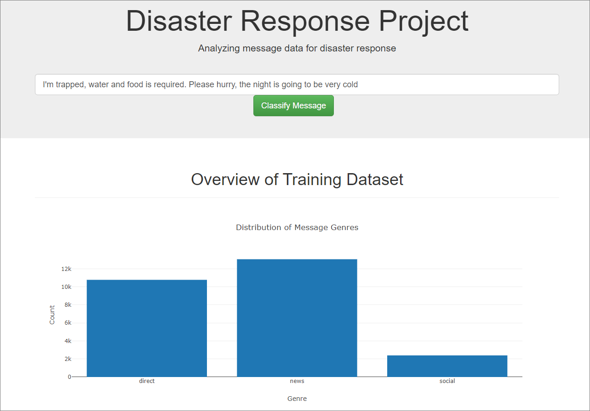
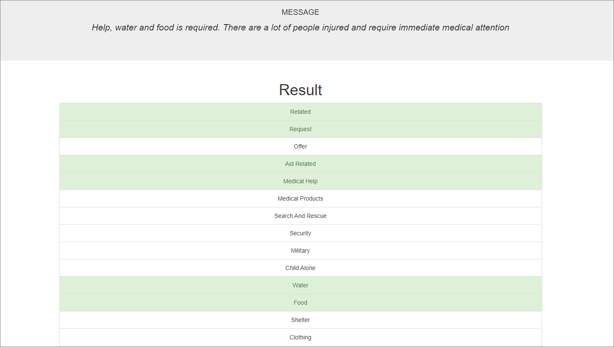
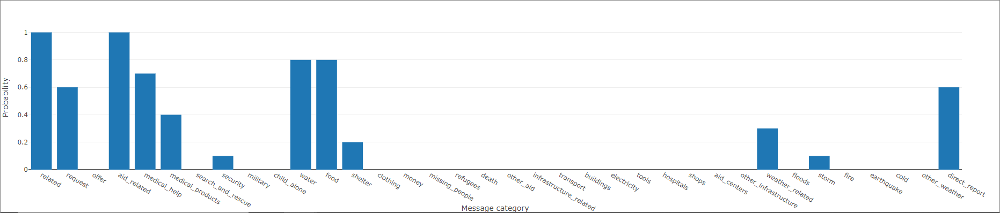

# Analyze Disaster Response Messages

## Installations
- plotly==2.0.15
- pandas==0.23.3
- numpy==1.12.1
- nltk==3.2.5
- Flask==0.12.5
- joblib==0.11
- SQLAlchemy==1.2.19
- scikit-learn==0.19.1


## Project Motivation
To analyze disaster messages data from [Appen](https://appen.com/) for quick classification of messages into categories, resulting in efficient responses from appropriate disaster relief agencies.

Examples of disaster categories include shelter, food, safety, etc.

## Files
### Structure
```
## File structure
.
├── README.md
├── app
│   ├── run.py
│   ├── static
│   │   ├── bootstrap-theme.min.css
│   │   └── bootstrap.min.css
│   └── templates
│       ├── go.html
│       └── master.html
├── data
│   ├── disaster_categories.csv
│   ├── disaster_messages.csv
│   └── process_data.py
├── img
│   ├── homepage.PNG
│   ├── probability.PNG
│   └── results.PNG
└── models
    └── train_classifier.py
```

### Dataset
- `data/disaster_messages.csv` - Dataset containing messages in string format
- `data/disaster_categories.csv` - Dataset which corresponds to `disaster_messages.csv` via `id`, and which contains labels for all 36 disaster categories

### Project Components
1. `data/process_data.py` - Extract Transfer Load (ETL) Pipeline
   - Loads the `messages` and `categories` datasets
   - Merges the two datasets
   - Cleans the data
   - Stores it in a SQLite database
2. `models/train_classifier.py` - Machine Learning (ML) Pipeline
   - Loads data from the SQLite database
   - Splits the dataset into training and test sets
   - Builds a text processing and machine learning pipeline
   - Trains and tunes a model using GridSearchCV
   - Outputs results on the test set
   - Exports the final model as a pickle file

3. `app/run.py` - Flask app
   - Accepts message as an input and obtains classification of message into disaster categories
   - Provides data visualisation of probabilities of each individual disaster message

## Instructions:
1. Run the following commands in the project's root directory to set up your database and model.
    - To run ETL pipeline that cleans data and stores in database
        `python data/process_data.py data/disaster_messages.csv data/disaster_categories.csv data/DisasterResponse.db`
    - To run ML pipeline that trains classifier and saves
        `python models/train_classifier.py data/DisasterResponse.db models/classifier.pkl`

2. Go to `app` directory: `cd app`

3. Run your web app: `python run.py`

4. Click the `PREVIEW` button to open the homepage

## Preview
### Homepage


### Results


### Probability of categories of each result


## Acknowledgements and references
- [Source of disaster messages](https://appen.com/)
- [Boostrap 3.3.7 physical file as link is broken](https://blog.getbootstrap.com/2016/07/25/bootstrap-3-3-7-released/)

## Further improvements
1. Applying SMOTE for imbalanced datasets
   - [machinelearningmastery](https://machinelearningmastery.com/smote-oversampling-for-imbalanced-classification/)
   - [Kaggle - dealing with imbalanced data](https://www.kaggle.com/tboyle10/methods-for-dealing-with-imbalanced-data)
2. Additional practices to improve text classification model
   - [Analytics Vidya Reference](https://www.analyticsvidhya.com/blog/2015/10/6-practices-enhance-performance-text-classification-model/)
   - [Kaggle Extensive Data Feature Engineering](https://www.kaggle.com/shivamb/extensive-text-data-feature-engineering)
3. [Gensim Word2Vec](https://www.kaggle.com/pierremegret/gensim-word2vec-tutorial)
